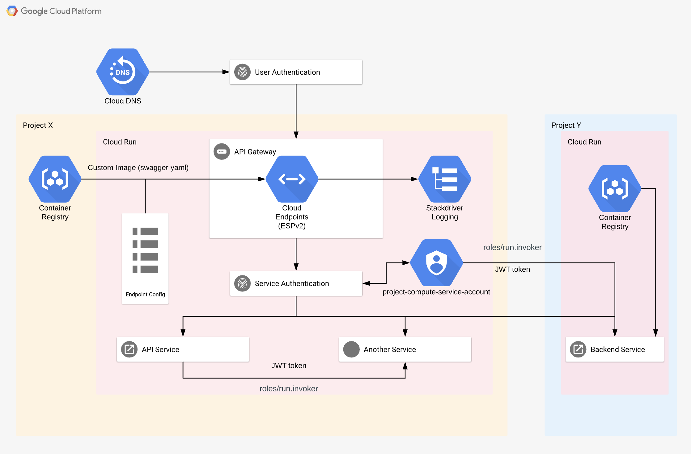

# GCP API GW on Cloud Run Example Solution



## Requirements for API and BACKEND service CI/CD pipelines

To be able to launch these example ci/cd pipelines you need these:

- Create GCP own projects for API and BACKEND. Configure project name in .github/workflows/<pipeline>.yml file.
  ```
  GCP_PROJECT: <project_name>
  ```
- Enable google service APIs for both project. 
  ```
  gcloud config set project <project_name>

  gcloud services enable containerregistry.googleapis.com
  gcloud services enable run.googleapis.com
  gcloud services enable servicemanagement.googleapis.com
  gcloud services enable servicecontrol.googleapis.com
  gcloud services enable endpoints.googleapis.com
  gcloud services enable cloudbuild.googleapis.com
  ```
- GCP service account for ci/cd pipeline in project. Add following permissions for the service account.
  ```
  roles/storage.admin
  roles/cloudRun.admin
  roles/serviceAcount.user
  ```
- Add project editor role for ci-cd pipeline service account to API project 
  ```
  gcloud projects add-iam-policy-binding <project_name> \
  --member serviceAccount:<ci-cd-pipeline_service_account_name> \
  --role roles/editor
  ```
- Download JSON key, encode it with base64 and upload to github secrets. 
  ```
  cat <gcp_project_service_account_key>.json | base64
  ``` 
- Configure key name from github secrets in .github/workflows/example_backend.yml file
  ```
  service_account_key: ${{ secrets.<github_secrets_key_name> }}
  ```